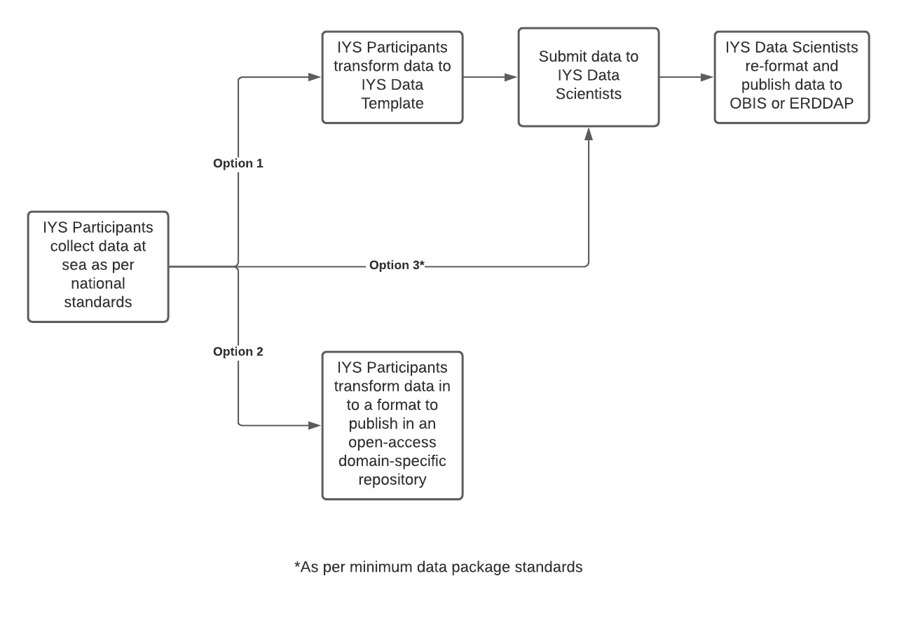

The ultimate goal of the IYS Data Mobilization Strategy is that all expedition data are able to cruise participants, and that data are archived in open-access domain-specific data repositories where they will contribute to globally integrated analyses. How and where data are published will vary by research domain and based on the standard operating procedures of each nation. Therefore, we anticipate three workflow options for submitting data (Figure 1). 

* **Data files** 
  - *Option 1:* Before submission to IYS Data Scientists, IYS Participants should transform catch/specimen data, CTD, Rosette, and other sampling data to the [IYS Data Template](https://github.com/international-year-of-the-salmon/about/blob/main/IYS2022_Data_template_final.xlsx?raw=true) submission format. This template establishes a common sampling event schema that will make it easier to link various samples and events together.
  - *Option 2:* Not for CTD, catch/specimen data, Rosette, or other standard data collected on every ship (see option 1 data template for those). Option 2 may be preferable for laboratory-analysis derived data for a) data types that IYS Participants have well-established workflows for publishing to open-access repositories; or b) There is institutional or national support available for data management and data transformations and/or a desire to build capacity in publishing data to open-access repositories such as OBIS
  - *Option 3:* Provided in case there are no resources available for option 1 or 2. Files should be plain text (.csv) or Microsoft excel files, but should not require other proprietary software.

In all cases:

- Indicate the time zone of date and time columns (UTC is preferred)
- Report locations as latitude and longitude in decimal degrees (ie. 49.12345, -110.54321)
- Include unique sample identifiers

Please submit data before the deadlines noted in the [Data Policy](https://docs.google.com/document/d/1srIlyZfNdtGQ4-W8Ch2FStLnn9U_wW5WIS5wQ1E62w0/edit?usp=sharing) by emailing datasets to secretariat@npafc.org and iys.data@hakai.org as a data package with additional files laid out in the Required Data Package section below.

## Required Data Package Files:

* **Data files** Ideally in the IYS data template, in .csv or .xlsx format with time zone indicated (UTC preferred), latitude and longitude in decimal degrees, and unique sample identifiers.

* **Data Dictionary:** Define each variable (column name) in every table of your data. Include variable name, units, and short description if needed. Note that for Trawl catch/specimen data, CTD data, and Rosette the Data Dictionary exists as a tab in the Template Spreadsheet File. 

* **README file** (.txt or .docx) with the following sections:

  - **Statement of Data Access:** When can data submitted be made public? Can all of the submitted data be published, or can only a summarized/aggregated view be published? Keep in mind timelines should be in accordance with the [IYS Data Policy](https://international-year-of-the-salmon.github.io/about/Final%20IYS%20Data%20Policy_Dec132021.pdf)

  - **Abstract:** (400 words) This information will appear as the summary text in the metadata catalogue. Focus on **what** variables were measured, **how** the variables were measured, and **why** the data were collected to inform your hypotheses.

  - **Protocols**: Describe thoroughly the field, lab, and data processing protocols used to produce your data. This could be the same text used in a Cruise Report if there is sufficient information to reproduce methods.
  
* **Supplementary Materials** Provide publication(s) referenced in protocol description. Provide any scripts or calibration files that were used to clean up/quality control data, filter data from the raw data, or calculate values in the final data package.

See an [example data package to copy here](https://github.com/international-year-of-the-salmon/example-data-package/archive/refs/heads/main.zip). 

Ensure you have filled out authorship metadata for your data set in the [metadata spreadsheet](https://docs.google.com/spreadsheets/d/1grJN_xPZScd4r-IgUK7v_jnCs5IGKhDDElTskt6qdAQ/edit?usp=sharing) to ensure appropriate citation for dataset authors.

Email data packages to secretariat@npafc.org and iys.data@hakai.org

