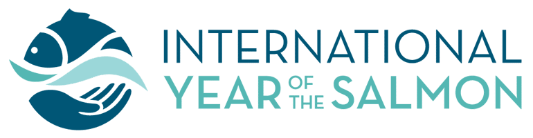

---
hide:
  - navigation
title: 
---

</img>
# 

## Open Access to IYS Data

**Data Mobilization**: The process of making data available for appropriate re-use.

Welcome to the International Year of the Salmon Data Mobilization Portal. The International Year of the Salmon was in 2019 but with projects lasting to 2024. This site is intended to be portal to centralize access to open access data, summaries of data publishing as well as technical documentation and policies.

<iframe frameborder="0" scrolling="no" src="assets/relationships.html" width="1500" height="900"></iframe>
**Figure 1.** Network of published IYS datasets and their citations

## How to Provide Data

**What is required by IYS scientists providing data?**

1) Register the dataset you have collected or will generate by filling out [this metadata intake form](https://cioos-siooc.github.io/metadata-entry-form/#/en/iys/submissions). 

2) Submit data to the IYS (secretariat@npafc.org and cc iys.data@hakai.org) for internal sharing and/or publishing to the [IYS Data Catalogue](https://iys.hakai.org/) according to the [Data Submission Guidelines](https://international-year-of-the-salmon.github.io/about/Data-Submission-Guidelines.html).

3) If you are a cruise participant and you would like to access data that has not yet been made publicly available [Create a free GitHub account](https://github.com/signup) and share your username with IYS Data Scientists by emailing us what your username is at secretariat@npafc.org and iys.data@hakai.org so that we can add you to the IYS organizational data hosting service and you can access and share internal data before it goes public (according to the [IYS policy](https://international-year-of-the-salmon.github.io/about/Final%20IYS%20Data%20Policy_Dec132021.pdf)).

4) Remember to cite datasets used in publications according to the recommended citation for each specific dataset in the [IYS Data Catalogue](https://iys.hakai.org)

**The IYS Data Science team will provide the following services:**

1) Review and publish your data record in the [IYS Data Catalogue](https://iys.hakai.org). You will receive a Digital Object Identifier that will make your dataset discoverable and citable.

2) Store and host your data on the [IYS GitHub repository](https://github.com/international-year-of-the-salmon/).

3) In some cases, we have and will continue to standardize data for publishing in domain-specific data servers as well.

## Access Data

See our data catalogue at https://iys.hakai.org or see our GitHub repository at https://github.com/international-year-of-the-salmon

